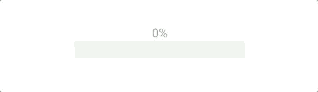
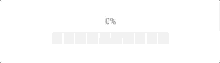
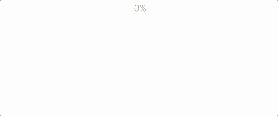
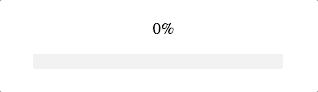

#  :sparkles: React Progressor :sparkles:

A collection of customizable progress bars for React and React Native.


### Install

using npm:


`npm i -S react-rn-progressor`

using yarn:

`yarn add --dev react-rn-progressor`

## Usage/Demo - Mobile

<details>
  <summary> Line </summary>

  

  ```javascript

    import { LineProgressor } from 'react-progressor/mobile';

    <LineProgressor

     width={200} /* Width of the progress bar.
                  * Required value
                  * Type: number
                  * Default: 200
                  */

      height={20} /* Height of the progress bar.
                  * Type: number
                  * Default: 20
                  */

      progress={0}   /* Value of progress to display (0 - 100)%
                      * Required value
                      * Type: number (0 - 100)
                      * Default: 0 (starting point)
                      */

      trackColor='#eee'   /* Color of the track (background)
                           * Type: string
                           * Default: '#eee'
                           */
      
      progressColor='#8DE969'    /* Color of the progress indicator
                                  * Type: string
                                  * Default: '#8DE969'
                                  */

      animEasing='easeInEaseOut'   /* A name of animation 
                                    * to apply for progress indicator
                                    * Type: string
                                    * Default: 'easeInEaseOut'
                                    */

      animDuration={200}       /* A duration of animation (in ms)
                                * Type: number
                                * Default: 200
                                */
    />

  ```
    
</details>

<details>
  <summary> Fence </summary>

  

  ```javascript

    import { FenceProgressor } from 'react-progressor';

    <FenceProgressor

      width={200} /* Width of the progressor
                   * Required value
                   * Type: number
                   * Default: 200
                   */
      
      height={30} /* Height of the progressor
                   * Type: number
                   * Default: 30
                   */

      progress={0} /* Value of the progress (0-100)
                    * Required value
                    * Type: number
                    * Default(initial value): 0
                    */

      blockNumber={10} /* Numbers of smaller blocks in progressor
                        * Type: number
                        * Default: 10
                        */

      activeColor='#8DE969'   /* Color of active bar
                               * Type: string
                               * Default: '#8DE969'
                               */

      inactiveColor='#eee'     /* Color when bar is not active
                                * Type: string
                                * Default: '#eee'
                                */

      animDuration={200}  /* Duration of animation
                           * Type: number
                           * Default: 200
                           */
      
      animEasing='spring'    /* Easing to be applied to animation
                              * Type: string
                              * Available: ['linear', 'spring', 'easeInEaseOut']
                              * Default: 'spring'
                              */
    />

  ```

</details>

<details>
  <summary> FillCircle </summary>
   

   ```javascript

    import { FillCircleProgressor } from 'react-progressor/mobile';

    <FillCircleProgressor

     size={150}  /* Size of the progress.
                  * Applies for both width and height to keep ratio.
                  * Required value
                  * Type: number
                  * Default: 150
                  */

      progress={0}   /* Value of progress to display (0 - 100)%
                      * Required value
                      * Type: number (0 - 100)
                      * Default: 0 (starting point)
                      */

      inactiveColor='#eee'   /* Color of the background, when circle is not filled
                              * Type: string
                              * Default: '#eee'
                              */
      
      activeColor='#8DE969'      /* Color of the progress indicator
                                  * Type: string
                                  * Default: '#8DE969'
                                  */

      animDuration={200}       /* A duration of animation (in ms)
                                * Type: number
                                * Default: 200
                                */
    />

   ```

</details>

## Usage/Demo - Web

<details>
  <summary> Line </summary>

  

  ```javascript

    import { LineProgress } from 'react-progressor/web';

    <LineProgress

      width={150} /* Width of the progress bar.
                  * Required value
                  * Type: number
                  * Default: 150
                  */

      height={5} /* Height of the progress bar.
                  * Type: number
                  * Default: 5
                  */

      progress={0}   /* Value of progress to display (0 - 100)%
                      * Required value
                      * Type: number (0 - 100)
                      * Default: 0 (starting point)
                      */

      trackColor='#eee' /* Color of the track (background)
                          * Type: string
                          * Default: '#eee'
                          */
      
      progressColor='#8DE969'  /* Color of the progress indicator
                                  * Type: string
                                  * Default: '#8DE969'
                                  */

      transitionFunc='linear'  /* A name of CSS3 transition timing function 
                                  * to apply for progress indicator
                                  * Type: string
                                  * Default: 'linear'
                                  */

      transitionDuration={200} /* A duration of CSS3 transition (in ms)
                                * Type: number
                                * Default: 200
                                */
    />

  ```
</details>

<details>
  <summary> HalfCircle </summary>

  

  ```javascript

    import { HalfCircleProgressor } from 'react-progressor/web';

    <HalfCircleProgressor
    
      size={120} /* A size for this progressor
                  * Used for both width and height (to keep ratio)
                  * Required value
                  * Type: number
                  * Default: 120
                  */

      progress={0} /* Progress for this progressor (0-100)%
                    * Required value
                    * Type: number
                    * Default: 0 (starting value)
                    */

      circleHeight={5} /* Height or 'thickness' of circle border
                        * Type: number
                        * Default: 5
                        */

      circleColor='#eee' /* Color of a circle (track)
                          * Type: string
                          * Default: '#eee'
                          */

      progressColor='#8DE969' /* Color of filled circle (progress)
                               * Type: string
                               * Default: '#8DE969'
                               */

      transitionFunc='linear' /* A name of CSS3 transition timing function 
                               * Type: string
                               * Default: 'linear'
                               */

      transitionDuration={200} /* A duration of CSS3 transition (in ms)
                                * Type: number
                                * Default: 200
                                */
    />

  ```
</details>

## Authors

* **Krzysztof Borowy** - [Krizzu](https://github.com/Krizzu)


## License

This project is licensed under the MIT License - see the [LICENSE](LICENSE) file for details
